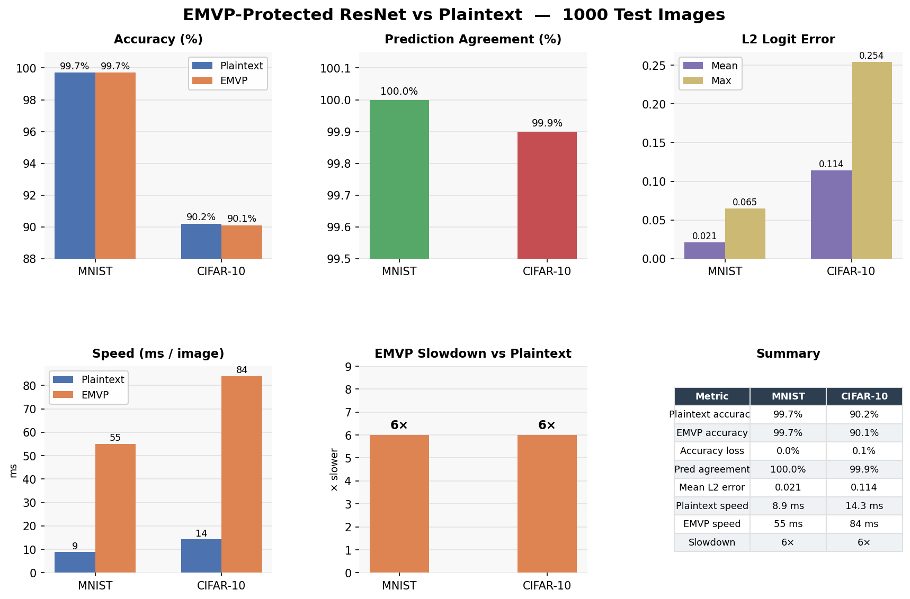

# EMVP-Protected ResNet

Privacy-preserving image classification using the **Encrypted Matrix-Vector
Product (EMVP)** protocol from:

> *Encrypted Matrix-Vector Products from Secret Dual Codes*  
> Benhamouda, Chen, Halevi, Ishai, Krawczyk, Mour, Rabin, Rosen  
> CCS 2025 / ePrint 2025/858

A client submits an image for classification. The server holds the model
weights and performs all computation, but **never sees the client's input
activations in the clear**. Only query privacy is implemented — weights are
public, activations are private.

---

## The Protocol

### Setup

Every linear layer stores an encoded weight matrix rather than the raw
weights. Given a weight matrix `M ∈ F^{m×ℓ}` and a secret key consisting
of a random matrix `C1 ∈ F^{k×ℓ}` and scalar masks `α_1, …, α_s`, the
server computes and stores:

```
M_hat = M @ D    where D = [-C1^T | I_ℓ] ∈ F^{ℓ×n},  n = k + ℓ
```

The matrix `D` is derived from the client's secret key and is discarded
after setup. The key structural property is dual orthogonality:

```
C @ D^T = 0    where C = [I_k | C1]
```

This guarantees that any random codeword `c ∈ rowspan(C)` satisfies
`M_hat @ c = 0`, which is what allows the blinding terms to cancel on
decoding.

### Query Encryption

For each inference, the client encrypts its activation vector `q ∈ F^ℓ`:

1. Sample a fresh random vector `a ∈ F^k`
2. Form the blinded query: `q_tilde = a^T C + [0_k | q]`
3. Split `q_tilde` into `s` blocks and scale each by a secret scalar:
   `q_hat_j = α_j · q_tilde_j`
4. Send `q_hat` to the server; retain `p' = (1/α_1, …, 1/α_s)` for decoding

### Server Answer

The server computes `s` block matrix-vector products and returns:

```
M'_j = M_hat_j @ q_hat_j    for j = 1, …, s
```

### Decoding

The client recovers the result:

```
M @ q = Σ_j  M'_j · (1/α_j)
```

**Correctness:** The scalar masks cancel (`α_j · 1/α_j = 1`). The blinding
vector `a^T C` vanishes by dual orthogonality (`M_hat @ (a^T C)^T = 0`).
The remaining term is exactly `M @ q`.

**Security:** The scalar masking implements 1D-SLSN. Without it, the server
sees samples from a linear secret-sharing code (LSN), which is vulnerable
to algebraic attacks. Multiplying each block by a secret scalar lifts
hardness to sub-exponential, defeating all known algebraic attacks.

---

## Architecture

The model is a small ResNet trained for CIFAR-10 (3-channel, 32×32) and
MNIST (1-channel, 28×28):

```
Input (C_in, H, W)
  → Conv1 + BN (folded) + ReLU
  → Stage 1: n_blocks × ResidualBlock(16 → 16)
  → Stage 2: n_blocks × ResidualBlock(16 → 32, stride=2 on first block)
  → Stage 3: n_blocks × ResidualBlock(32 → 64, stride=2 on first block)
  → GlobalAveragePool
  → FC(64 → num_classes)
```

Each `ResidualBlock` is two ConvBNReLU layers with an optional 1×1 shortcut
conv. Several design choices are dictated by the cryptographic setting:

**Average pooling (not max pooling).** Max pooling requires comparisons,
which are nonlinear operations that cannot be evaluated on encrypted
activations without first decrypting. Average pooling is a linear operation
and folds cleanly into the preceding matrix multiply.

**Batch norm folding.** At inference time, a Conv+BN pair is a composition
of two linear maps and is therefore itself a single linear map. The BN
parameters are absorbed into the conv weight matrix before encryption:

```
scale  = γ / √(var + ε)
W_fold = W · scale[:, None, None, None]
b_fold = β − mean · scale
```

The EMVP protocol sees only `W_fold` — a single matrix `M` — with no
knowledge of whether it originated from one layer or several.

**Convolution via im2col.** Each receptive-field patch of the input is
flattened into a column, producing a patch matrix of shape
`(C_in·kH·kW, n_patches)`. The reshaped conv weight `(C_out, C_in·kH·kW)`
then multiplies the entire patch matrix in a single batched EMVP call
(described below), rather than one call per patch.

**Fixed-point arithmetic.** All EMVP operations are over `F_p` where
`P = 2^61 − 1` (61-bit Mersenne prime). Activations are quantized before
encryption and dequantized after decoding:

```
quantise(x)   = round(x · SCALE) mod P    (SCALE = 1024)
dequantise(x) = to_signed(x) / SCALE²
```

Division by `SCALE²` accounts for one factor of `SCALE` from the weights
and one from the activations.

---

## Batched Matrix Multiplication

A naive implementation of EMVP for a convolutional layer processes each
spatial patch independently, issuing one round-trip per patch:

```python
# Naive: one EMVP call per patch
for j in range(n_patches):
    out[:, j] = emvp_layer.forward(col[:, j])
```

For a 32×32 feature map this is 1024 sequential calls, each doing `s`
separate matrix-vector products. The overhead of Python dispatch and
repeated field-element operations dominates the actual arithmetic.

Instead, all `p` patch vectors are stacked into a single matrix and
processed in one batched call. The EMVP protocol extends naturally: the
client encrypts all `p` queries simultaneously by sampling one blinding
vector per query and sharing the scalar masks `α_1, …, α_s` across the
batch. The server computes `s` matrix-matrix products rather than `s × p`
matrix-vector products:

```
M_prime = Σ_j  M_hat_j @ Q_hat_j    where Q_hat = [q_hat_1 | … | q_hat_p]
```

The client decodes all `p` outputs in one pass by scaling each column of
`M_prime` by the corresponding `1/α_j`. Correctness follows column-by-column
from the single-vector proof — each column independently satisfies the dual
orthogonality cancellation.

This batching turns `O(p)` small matrix-vector products into `O(s)` large
matrix-matrix products, which are handled efficiently by the C extension's
BLAS-style inner loop. The practical effect is a ~50× end-to-end speedup
over the sequential baseline.

---

## Results

Benchmarks were run on 1000 test images per dataset on an Apple M1 Max
(CPU, C extension backend).



| Metric | MNIST | CIFAR-10 |
|---|---|---|
| Plaintext accuracy | 99.7% | 90.2% |
| EMVP accuracy | 99.7% | 90.1% |
| Accuracy loss from encryption | 0.0% | 0.1% |
| Prediction agreement | 100.0% (1000/1000) | 99.9% (999/1000) |
| Mean L2 logit error | 0.021 | 0.114 |
| Max L2 logit error | 0.065 | 0.254 |
| Plaintext speed | 8.9 ms/image | 14.3 ms/image |
| EMVP speed | 55 ms/image | 84 ms/image |
| Slowdown (EMVP / plaintext) | 6× | 6× |

### Discussion

**Accuracy is essentially unaffected by encryption.** On MNIST, the
encrypted model achieves identical accuracy to the plaintext model (99.7%),
with 100% prediction agreement across all 1000 images — every single
prediction is unchanged. On CIFAR-10, accuracy drops by just 0.1 percentage
point (90.2% → 90.1%), with one image predicted differently out of 1000.
This near-perfect agreement confirms that the EMVP protocol introduces no
meaningful degradation in model quality.

**Logit errors reflect quantisation noise, not cryptographic error.** The
mean L2 logit errors (0.021 for MNIST, 0.114 for CIFAR-10) are consistent
with the fixed-point quantisation scale `SCALE = 1024`, which introduces a
per-element rounding error of `O(1/SCALE) ≈ 0.001`. The larger errors on
CIFAR-10 reflect deeper feature maps with more accumulated quantisation
noise across the 3-channel, 32×32 inputs. In both cases the errors are
small enough that the argmax prediction is virtually never affected.

**The 6× slowdown is the fundamental cost of encryption.** Plaintext
inference takes 8.9 ms (MNIST) and 14.3 ms (CIFAR-10) per image. EMVP
inference takes 55 ms and 84 ms respectively — a consistent 6× overhead.
This cost comes entirely from the modular arithmetic in `F_p`: each matrix
multiply must be performed exactly over a 61-bit prime field using 128-bit
integer arithmetic, which cannot take advantage of the floating-point
acceleration available to plaintext inference. The overhead is fixed
regardless of image content or predicted class, which is itself a useful
security property — timing side-channels reveal no information about the
query.

---

## Files

| File | Purpose |
|---|---|
| `emvp_resnet.py` | Core library: field arithmetic, EMVP protocol, ResNet model |
| `emvp_core.c` | C extension for fast F_p arithmetic (compile before use) |
| `train.py` | Train the ResNet on MNIST / CIFAR-10 and save BN-folded weights |
| `benchmark.py` | Benchmark: plaintext vs EMVP accuracy and speed |
| `plot_benchmark.py` | Generate `benchmark_results.png` from benchmark numbers |
| `benchmark_results.md` | Benchmark results in table form |
| `benchmark_results.png` | Benchmark results figure |
| `mnist_weights.npy` | Pretrained weights (99.7% MNIST test accuracy) |
| `cifar10_weights.npy` | Pretrained weights (90.2% CIFAR-10 test accuracy) |

---

## Quick Start

```bash
# 1. Compile the C extension
cc -O3 -march=native -shared -fPIC -o emvp_core.so emvp_core.c

# 2. Run the benchmark (uses pretrained weights)
python3 benchmark.py

# 3. Retrain from scratch (optional; requires PyTorch)
python3 train.py --dataset mnist
python3 train.py --dataset cifar10
```

---

## Dependencies

```
numpy >= 1.24
torch >= 2.0       # training only (train.py)
torchvision        # training and data loading only
matplotlib         # plotting only (plot_benchmark.py)
```

The core EMVP protocol and ResNet inference (`emvp_resnet.py`) require only
NumPy. PyTorch is needed only for training.

---

## Security Notes

- **Threat model:** Honest-but-curious server. The server follows the
  protocol faithfully but inspects all messages it receives.
- **What the server sees:** The encoded weight matrix `M_hat` and the
  encrypted query `q_hat`. Under the 1D-SLSN hardness assumption, `q_hat`
  reveals nothing about the client's activation `q`.
- **What the server does not see:** The secret key `(C1, alphas)`, the raw
  activation `q`, or any intermediate activation vector.
- **Weights are not hidden:** The right block of `M_hat` is literally `M`.
  This is the *query-only privacy* variant. Hiding the weights additionally
  requires a Trapdoored Matrix (TDM) layer (see §4 of the paper).
- **Setup assumption:** The server receives `D` once to compute `M_hat`,
  then must delete it. Retaining `D` allows the server to invert the
  encryption.
